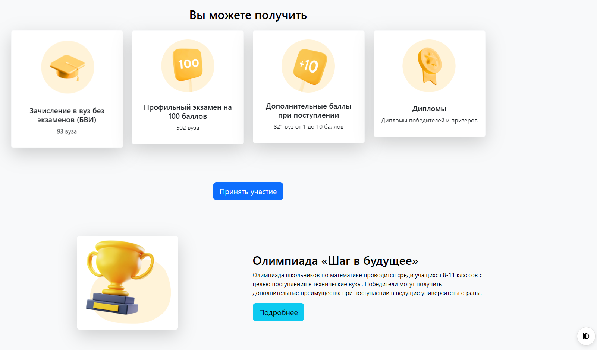
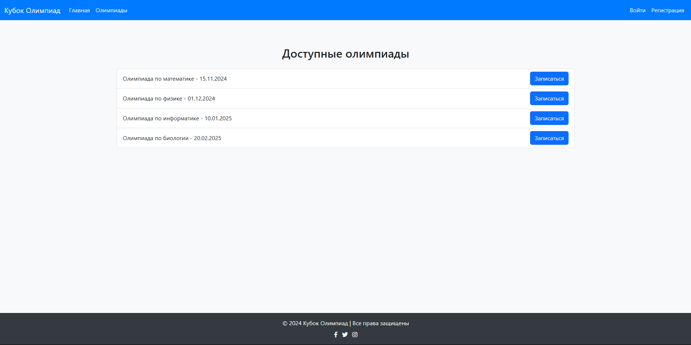
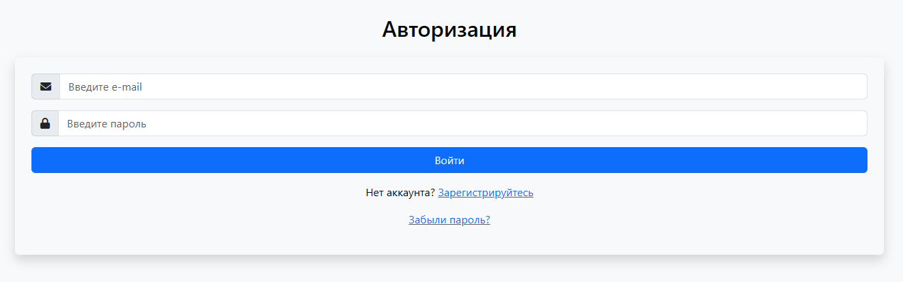
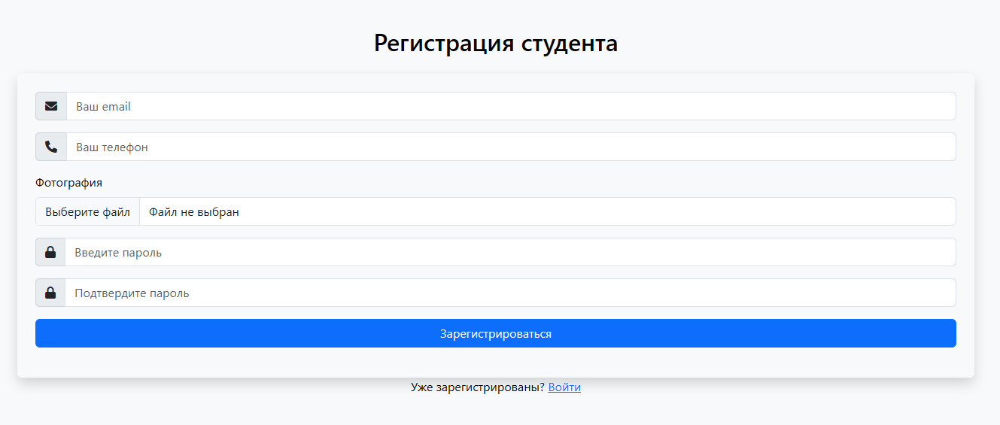

## Сайт для проведения олимпиад - Время Олимпиад


### Описание проекта

**Время Олимпиад** — это платформа для проведения онлайн-олимпиад, нацеленная на поддержку участников всех возрастов, позволяя регистрироваться, участвовать в конкурсах и просматривать свои результаты в режиме реального времени.

Проект построен на `Flask` и использует расширения, чтобы обеспечить удобный интерфейс, стабильную работу с базой данных и защищённую авторизацию пользователей.

### Основные функции

1. `Регистрация и авторизация`: Удобные формы для регистрации и входа, обеспечивающие безопасность данных и поддержку Pydantic для валидации.
2. `Профиль пользователя`: Страница профиля для отслеживания личных данных и достижений.
3. `Участие в олимпиадах`: Основной интерфейс для участия и подачи решений.
4. `Отображение результатов`: Интерактивная страница с результатами, доступная пользователям после завершения олимпиады.
5. `Обработка ошибок`: Поддержка пользовательской страницы 404, чтобы улучшить пользовательский опыт.










```
olympiad_time/
│
├── app/
│   ├── __init__.py            # Инициализация приложения
│   ├── forms.py               # Страницы форм (регистрации и авторизации)
│   ├── extensions.py          # Расширения Flask (например, db, login_manager)
│   ├── models.py              # Модели базы данных
│   │
│   ├── db/                    # Папка для работы с базой данных
│   │   ├── __init__.py        # Инициализация модуля базы данных
│   │   ├── models.py          # Модели базы данных
│   │   ├── migrations/        # Папка для миграций
│   │   └── database.py        # Инициализация базы данных и функций
│   │
│   ├── schemas/               # Папка для Pydantic схем
│   │   ├── __init__.py        # Инициализация схем
│   │   ├── auth.py            # Схемы для аутентификации
│   │   └── student.py         # Схемы для студентов
│   │
│   ├── forms/                 # Папка с формами
│   │   ├── __init__.py        # Инициализация форм
│   │   ├── auth.py            # Формы для аутентификации
│   │   └── student.py         # Формы для студентов
│   │
│   ├── routes/                # Папка с маршрутами
│   │   ├── __init__.py        # Инициализация маршрутов
│   │   ├── auth.py            # Маршруты для аутентификации
│   │   └── main.py            # Основные маршруты
│   │
│   ├── static/                # Статические файлы (CSS, JS, изображения)
│   │   ├── css/
│   │   │   └── styles.css
│   │   ├── js/
│   │   │   └── scripts.js
│   │   └── images/
│   │       └── trophy.png
│   │
│   └── templates/             # HTML-шаблоны
│       ├── base.html          # Основной шаблон (layout)
│       ├── index.html         # Шаблон для главной страницы
│       ├── login.html         # Шаблон для страницы входа
│       ├── register.html      # Шаблон для страницы регистрации
│       ├── profile.html       # Шаблон для профиля пользователя
│       ├── student.html       # Шаблон для регистрации студента
│       ├── results.html       # Шаблон для отображения результатов
│       └── 404.html           # Шаблон для страницы 404
│
├── instance/                  # Секретные данные (например, база данных)
│   └── olympiad_time.db
│
├── config.py                  # Конфигурация приложения
├── .env                       # Файл конфигурации окружения
├── .gitignore                 # Список игнорируемых файлов для Git
├── run.py                     # Точка входа для запуска приложения
└── requirements.txt           # Зависимости проекта
```

### Создание базы данных
```cmd
python .\create_db.py
python .\populate_db.py
```

### Запуск проекта
```cmd
python run.py
или
flask run
```

### Работа с проектом
```cmd
git init
git push origin master
```

### 📄 Лицензия

[Этот проект лицензирован под лицензией MIT](LICENCE)

Для получения дополнительной информации ознакомьтесь с файлом `LICENSE`

**Авторы:** Дуплей Максим и Егорова Ксения

**Дата:** 20.10.2024

**Версия:** 1.0
