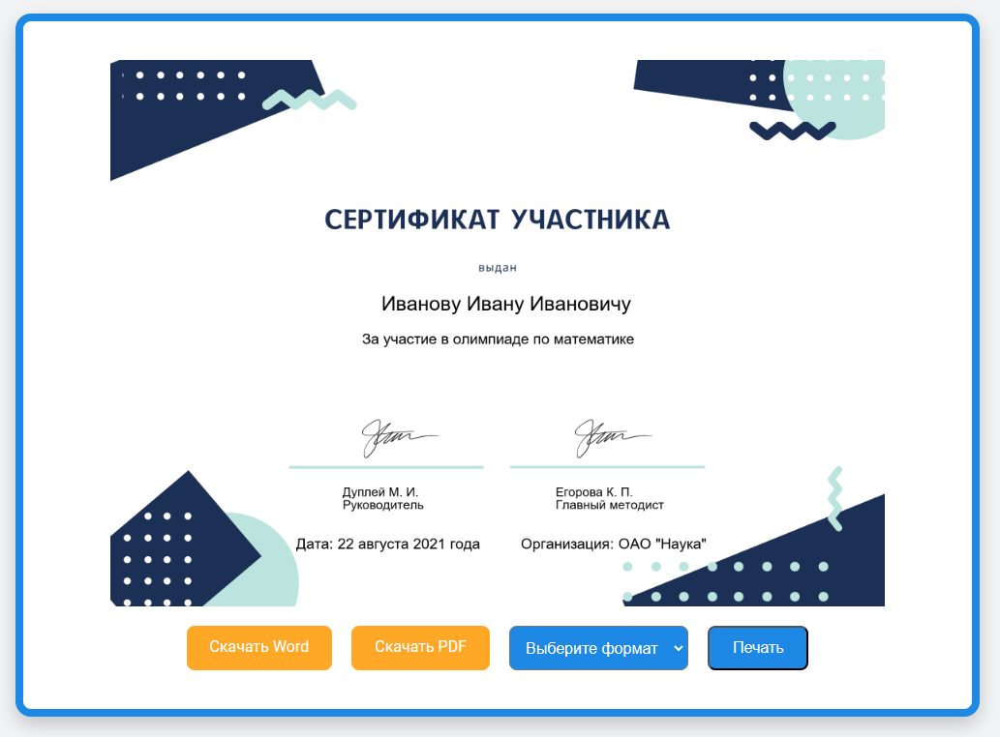

## Сайт для проведения олимпиад - Время Олимпиад


### Описание проекта

**Время Олимпиад** — это платформа для проведения онлайн-олимпиад, нацеленная на поддержку участников всех возрастов, позволяя регистрироваться, участвовать в конкурсах и просматривать свои результаты в режиме реального времени.

Проект построен на `Flask` и использует расширения, чтобы обеспечить удобный интерфейс, стабильную работу с базой данных и защищённую авторизацию пользователей.

### Основные функции

1. `Регистрация и авторизация`: Удобные формы для регистрации и входа, обеспечивающие безопасность данных и поддержку Pydantic для валидации.
2. `Профиль пользователя`: Страница профиля для отслеживания личных данных и достижений.
3. `Участие в олимпиадах`: Основной интерфейс для участия и подачи решений.
4. `Отображение результатов`: Интерактивная страница с результатами, доступная пользователям после завершения олимпиады.
5. `Обработка ошибок`: Поддержка пользовательской страницы 404, чтобы улучшить пользовательский опыт.


```
olympiad_time/
│
├── app/                                        # Основная директория приложения
│   ├── __init__.py                             # Инициализация приложения
│   ├── forms.py                                # Формы для регистрации и авторизации пользователей
│   ├── routes.py                               # Основные маршруты для обработки запросов
│   ├── asgi.py                                 # Конфигурация для асинхронного сервера (ASGI)
│   │
│   ├── db/                                     # Папка для работы с базой данных
│   │   ├── __init__.py                         # Инициализация модуля базы данных
│   │   ├── models.py                           # Модели базы данных (например, для студентов, олимпиад)
│   │   ├── utils.py                            # Вспомогательные функции для работы с базой данных
│   │   └── database.py                         # Инициализация подключения к базе данных
│   │
│   ├── schemas/                                # Pydantic схемы для валидации данных
│   │   ├── __init__.py                         # Инициализация схем
│   │   ├── auth.py                             # Схемы для аутентификации (например, для регистрации и входа)
│   │   └── student.py                          # Схемы для работы с данными студентов
│   │
│   ├── routes/                                 # Папка с маршрутами для обработки запросов
│   │   ├── __init__.py                         # Инициализация маршрутов
│   │   ├── auth.py                             # Маршруты для аутентификации
│   │   └── main.py                             # Основные маршруты для работы с олимпиадами и сертификатами
│   │
│   ├── migrations/                             # Папка для миграций базы данных
│   │
│   ├── static/                                 # Статические файлы (CSS, JS, изображения)
│   │   ├── certificates/                       # Папка для сертификатов
│   │   │   ├── images/                         # Изображения сертификатов
│   │   │   │   ├── certificate_completed.png   # Завершенный сертификат
│   │   │   │   ├── certificate.png             # Шаблон сертификата
│   │   │   │   ├── podpis_1.png                # Подпись 1
│   │   │   │   └── podpis_2.png                # Подпись 2
│   │   │   ├── pdf/                            # Папка для PDF-сертификатов
│   │   │   └── word/                           # Папка для Word-сертификатов
│   │   ├── fonts/                              # Шрифты, используемые в проекте
│   │   │   └── OpenSans.ttf                    # Шрифт OpenSans
│   │   ├── css/                                # CSS-стили
│   │   │   └── styles.css                      # Основной файл стилей
│   │   ├── js/                                 # JavaScript-файлы
│   │   │   └── scripts.js                      # Скрипты для динамичных функций
│   │   └── images/                             # Изображения для интерфейса
│   │       └── trophy.png                      # Изображение трофея
│   │
│   └── templates/                              # HTML-шаблоны для рендеринга страниц
│       ├── base.html                           # Основной шаблон (layout)
│       ├── index.html                          # Главная страница
│       ├── login.html                          # Страница входа
│       ├── register.html                       # Страница регистрации
│       ├── profile.html                        # Страница профиля пользователя
│       ├── student.html                        # Страница регистрации студента
│       ├── results.html                        # Страница отображения результатов
│       ├── forgot_password.html                # Страница восстановления пароля
│       ├── olympiads.html                      # Страница создания и управления олимпиадами
│       ├── olympiads_list.html                 # Страница списка олимпиад
│       ├── register_olympiad.html              # Страница регистрации олимпиады
│       ├── certificate.html                    # Страница генерации сертификатов
│       ├── edit_profile.html                   # Страница редактирования профиля
│       └── 404.html                            # Страница ошибки 404
│
├── instance/                                   # Директория для секретных данных (например, база данных)
│   └── olympiad_time.db                        # Основная база данных проекта
│
├── config.py                                   # Конфигурация приложения
├── create_db.py                                # Скрипт для создания базы данных
├── LICENCE                                     # Лицензия проекта
├── .env                                        # Конфигурация окружения
├── .gitignore                                  # Список игнорируемых файлов для Git
├── run.py                                      # Точка входа для запуска приложения
└── requirements.txt                            # Список зависимостей проекта
```

### Создание базы данных

```cmd
python .\create_db.py
python .\populate_db.py
```

### Запуск проекта

```cmd
python run.py
или
flask run
```

### Работа с проектом

```cmd
git init
git push origin master
```

### Генерация сертификатов



**Система поддерживает генерацию сертификатов для участников олимпиад в следующих форматах:**

- `PNG`
- `JPG`
- `BMP`
- `PDF`
- `Word (DOCX)`

### 📄 Лицензия

[Этот проект лицензирован под лицензией MIT](LICENCE)

Для получения дополнительной информации ознакомьтесь с файлом `LICENSE`

**Авторы:** Дуплей Максим и Егорова Ксения

**Дата:** 20.10.2024

**Версия:** 1.0
